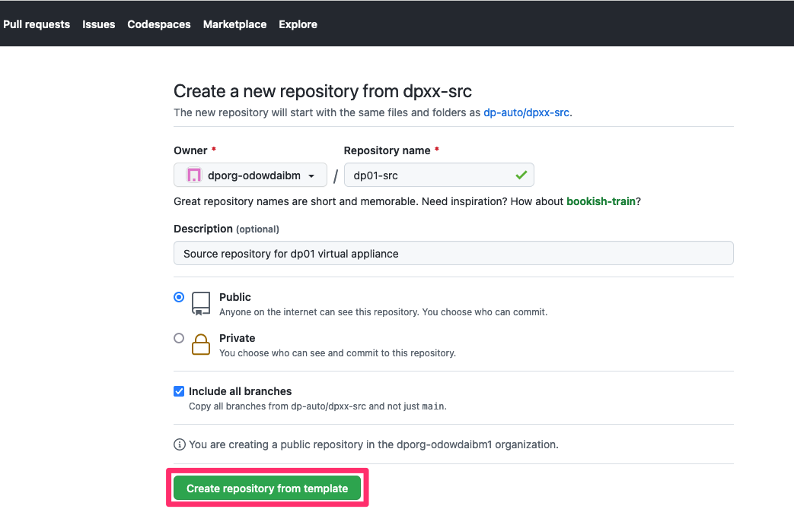
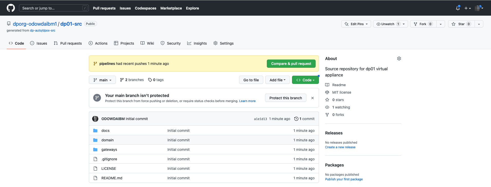
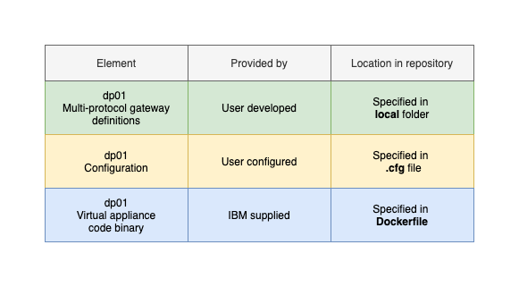

## Overview

This tutorial demonstrates a platform engineering approach to DataPower
development and deployment. It demonstrates continuous integration, continuous
deployment, GitOps, Infrastructure as Code and DevOps using containers,
Kubernetes and a set of popular cloud native tools such as ArgoCD and Tekton.

In this tutorial, you will:

1. Create a Kubernetes cluster and image registry, if required.
2. Create an operational repository to store DataPower resources that are
   deployed to the Kubernetes cluster.
3. Install ArgoCD to manage the continuous deployment of DataPower-related
   resources to the cluster.
4. Create a source Git repository that holds the DataPower development artifacts
   for a virtual DataPower appliance.
5. Install Tekton to provide continuous integration of the source DataPower
   artifacts. These pipeline ensures that all changes to these artifacts are
   successful built, packaged, versioned and tested before they are delivered
   into the operational repository, read for deployment.
6. Gain experience with the IBM-supplied DataPower operator and container.

By the end of the tutorial, you will have practical experience and knowledge of
platform engineering with DataPower in a Kubernetes environment.

---

## Introduction

The following diagram shows a CICD pipeline for DataPower:


Notice:

- The git repository `dp01-src` holds the source development artifacts for a
  virtual DataPower appliance `dp01`.
- A Tekton pipeline uses the `dp01-src` repository to build, package, test,
  version and deliver resources that define the `dp01` DataPower appliance.
- If the pipeline is successful, then the YAMLs that define `dp01` are stored in
  the operational repository `dp01-ops` and the container image for `dp01` is
  stored in an image registry.
- Shortly after the changes are committed to the git repository, an ArgoCD
  application detects the updated YAMLs. It applies them to the cluster to create or
  update a running `dp01` DataPower virtual appliance.


This tutorial will walk you through the process of setting up this configuration:
- Step 1: Follow [these instructions this
  repository](https://github.com/dp-auto/dpxx-ops#readme) to set up your
  cluster, ArgoCD and the `dp01-ops` repository. When complete, you will return
  to this repository to complete step 2.
- Step 2: Continue with the instructions in this README to create the `dp01-src`
  repository, run a tekton pipeline to populate the `dp01-ops` repository and
  interact with the new or updated DataPower appliance `dp01`.

---

## Recreating Environment Variables

If you're doing this tutorial over an extended period, it may result in you using a different terminal session. In this case, 
don't forget to re-define the following environment variables:

```bash
export GITUSER=<GitHub user name>
export GITORG=dporg-$GITUSER
export GITTOKEN=<PAT copied from GitHub>
export GITCONFIG=$(printf "[credential \"https://github.com\"]\n  helper = store")
```

## Creating the `dp01-src` repository

We use this [template repository](https://github.com/dp-auto/dpxx-src) to create
`dp01-src` in our new organization. Forking a template creates a repository with
a clean git history, allowing us to track the history of changes to our virtual appliance `dp01` every time we update `dp01-src`.

<br> Click on [this URL](https://github.com/dp-auto/dpxx-src/generate) to fork
from the `dpxx-src` template repository:



This screen allows you to define the properties for you copy of the `dp01-src`
repository.

Specifically:

* In the `Owner` dropdown, select your recently created organization, e.g. `dporg-xxxxx`
* In the `Repository name` field, specify `dp01-src`.
* In the `Description` field, specify `Source repository for dp01 virtual
  appliance`.
* Select `Public` for the repository visibility.
* Select `Include all branches`.

<br> Click on `Create repository from template`:

<br> This repository will be cloned to the specified GitHub account:


<br> You have successfully created a copy of the `dp01-src` repository in your
organization.

---

## Clone repository to your local machine

We're going to use the contents of the `dp01-src` repository to build the `dp01`
virtual appliance. First we need to clone this repository to our local machine.

In the terminal window, issue the following command:

```bash
cd $HOME/git/$GITORG-tutorial
git clone https://github.com/$GITORG/dp01-src.git
cd dp01-src
```

which will clone the repository to your local machine.

```bash
Cloning into 'dp01-src'...
remote: Enumerating objects: 69, done.
remote: Counting objects: 100% (69/69), done.
remote: Compressing objects: 100% (58/58), done.
remote: Total 69 (delta 4), reused 52 (delta 2), pack-reused 0
Receiving objects: 100% (69/69), 390.75 KiB | 1.01 MiB/s, done.
Resolving deltas: 100% (4/4), done.
```

---

## The source repository branches

The `dp01-src` repository holds both the development artifacts for the DataPower
virtual appliance `dp01` as well as the Tekton pipeline definition to build it.

Issue the following commands to see these branches

```bash
git branch -r
```

which shows two branches (not including HEAD, which is the current branch):

```bash
origin/HEAD -> origin/main
origin/main
origin/pipelines
```

The source artifacts for `dp01` are held in the `main` branch. The `pipelines`
branch holds the Tekton pipeline definitions used to build, test and version
these artifacts.

---

### The `main` branch

The `main` branch folder structure of the `dp01-src` repository reflects the
structure of the `dp01` virtual appliance.

<br> There are three elements of the `dp01` virtual DataPower appliance as shown
in the following diagram:



Note
* `dp01` has a set of multi-protocol gateway definitions that are developed by a
  user, each of which is specified in a gateway `local` folder.
* Each gateway has a user specified configurations that is specified in a gateway
  `.cfg` file.
* `dp01` runs these gateways and configuration in a container that uses an image
  based on binary code provided by IBM. We use a `Dockerfile` to identify the
  precise version of this binary code.

Let's explore the repository to see this structure.

```bash
tree -L 1
```

```bash
.
├── LICENSE
├── README.md
├── docs
├── domain
└── gateways
```

Notice the simplicity of this structure: a `LICENSE` file, this `README` and
associated documentation in `docs`, together with a domain and a set of
gateways. Let's explore the `domain` and `gateways` folders a little more deeply.

Issue the following command:

```bash
tree domain gateways
```

which will show the structure of these folders:

```bash
domain
└── Dockerfile
gateways
├── gateway01
│   ├── config
│   │   └── BookingServiceBackend.cfg
│   ├── local
│   │   └── BookingServiceBackend
│   │       ├── BookingServiceBackend
│   │       │   ├── BookingResponse_Transform.xsl
│   │       │   └── BookingServiceBackend_Transform.xsl
│   │       ├── GenerateBaggageStatusSOAPResponse.xsl
│   │       ├── ReservationCodeFilter.xsl
│   │       ├── airportDetail.js
│   │       ├── bookingservice.wsdl
│   │       ├── readLocalFile.js
│   │       └── www
│   │           └── ibmair
│   │               └── index.html
│   └── yamls
│       ├── booking-service-ingress.yaml
│       ├── booking-service-service.yaml
│       ├── gateway-webui-service.yaml
│       └── gateway.yaml
└── gateway02
```

Note:
* It makes sense for each DataPower virtual appliance domain to map to a
  container. It provides a natural unit for isolation, management and scaling.
  The `Dockerfile` in the `domain` folder contains the exact version DataPower
  image being used by `dp01`.
* 


---

## Work on pipelines

```bash
cd dp01-src
git checkout pipelines
```

---

## Login to cluster

```bash
oc login
```

---

## Locate Datapower pipeline source

```bash
cd $HOME/git/datapower/dp01-src/pipelines/dev-build
ls
```

---

## Update ingress YAML

The ingress used by the dp01 appliance needs to be customized for the cluster. It would be better to do this customization at deployment time, as this is the point where we know which cluster to which we're going to deploy. To simplify the tutorial we do it now.

The YAML is sourced from the `dp01-src` repository and looks like this:

```yaml

apiVersion: networking.k8s.io/v1
kind: Ingress
metadata:
  name: booking-service
  namespace: dp01-dev
spec:
  rules:
    - host: booking-service-dp01-dev.<cluster sub-domain>
# replace <cluster sub-domain> with output from: oc get ingresscontrollers/default -n openshift-ingress-operator -o jsonpath='{.status.domain}'
      http:
        paths:
          - path: /
            pathType: Prefix
            backend:
              service:
                name: dp01-booking-service
                port:
                  number: 12001
```

Issue the following command to locate the ingress YAML used by your `dp01` appliance:

```bash
echo https://github.com/$GITORG/dp01-src/blob/main/gateways/gateway01/yamls/booking-service-ingress.yaml
```

It will return a URL, for example: 

```bash
https://github.com/dporg-odowdaibm2/dp01-src/blob/main/gateways/gateway01/yamls/booking-service-ingress.yaml
```

Copy this URL into your favourite browser.

Edit the ingress YAML file, replacing the `<cluster sub-domain>` with the output from the following command:

```bash
oc get ingresscontrollers/default -n openshift-ingress-operator -o jsonpath='{.status.domain}'
```

which will look something like this:

```bash
datapower-cluster-1-d02cf90349a0fe46c9804e3ab1fe2643-0000.eu-gb.containers.appdomain.cloud
```

Commit this change to GitHub; this Ingress file will now be used for your `dp01` virtual appliance.

---

## Create cluster pipeline resources
  
```bash  
oc apply -f dp-clone.yaml		
oc apply -f dp-gen-yamls.yaml	
oc apply -f dp-push.yaml
oc apply -f dp-dev-pipeline.yaml	
oc apply -f dp-store-yamls.yaml
oc apply -f dp-build-image.yaml		
oc apply -f dp-test.yaml
```

---

## Customize pipeline

```bash
value: git@github.com:$GITORG/dp01-src.git
value: git@github.com:$GITORG/dp01-ops.git
```


## Run pipeline

```bash
oc create -f dp-dev-pipelinerun.yaml
```

In the following command replace `xxxxx` with the new pipeline run identifier:

```bash
tkn pipelinerun logs dp-dev-pipeline-run-xxxxx -n dp01-dev -f
```

## View pipelinerun in the web console

Show progress in `tkn` command line tool?

## Try out service using API tool

Now that the dp01 virtual appliance is running the BookingService, we can test it.

You can use any API test tool; [RESTER](https://addons.mozilla.org/en-GB/firefox/addon/rester/) ois good if you use Firefox.

Configure the tool to make the following API request:

* **Method:** `POST`
* **URL:** `booking-service-dp01-dev.<cluster-subnet>`
* **Additional headers:** `Content-Type: application/xml`
* **Payload:**
   ```xml
   <soapenv:Envelope xmlns:soapenv="http://schemas.xmlsoap.org/soap/envelope/" xmlns:book="http://www.ibm.com/datapower/IBMAir/BookingService/">
      <soapenv:Header/>
      <soapenv:Body>
         <book:BookingRequest>
            <book:Booking>
               <book:ReservationCode>IBM99V16I</book:ReservationCode>
               <book:BookingType>I</book:BookingType>
               <book:PaymentCardDetails>
                  <book:Number>4485710246935191</book:Number>
                  <book:Expiry>
                     <book:Year>2017</book:Year>
                     <book:Month>2</book:Month>
                  </book:Expiry>
                  <book:CVV>924</book:CVV>
                  <book:Type>Visa</book:Type>
                  <book:HolderName>James Roberts</book:HolderName>
               </book:PaymentCardDetails>
               <book:BillingDetails>
                  <book:FirstName>James</book:FirstName>
                  <book:LastName>Roberts</book:LastName>
                  <book:Address>314 S. Wells St</book:Address>
                  <book:City>Chicago</book:City>
                  <book:State>IL</book:State>
                  <book:ZIP>60606</book:ZIP>
                  <book:Country>USA</book:Country>
               </book:BillingDetails>
            </book:Booking>
         </book:BookingRequest>
      </soapenv:Body>
   </soapenv:Envelope>
   ```

The request should return `200 OK` with the following `Response`:

   ```xml
   ?xml version="1.0" encoding="UTF-8"?>
   <soapenv:Envelope
       xmlns:soapenv="http://schemas.xmlsoap.org/soap/envelope/"
       xmlns:book="http://www.ibm.com/datapower/IBMAir/BookingService/">
       <soapenv:Header/>
       <soapenv:Body>
           <!--Happy Path UC1-->
           <book:BookingResponse>
               <book:ConfirmationText>Processed 0112459898A</book:ConfirmationText>
               <book:Booking>
                   <book:ReservationCode>IBM99V16I</book:ReservationCode>
                   <book:BookingType>I</book:BookingType>
                   <book:PaymentCardDetails>
                       <book:Number>************5191</book:Number>
                       <book:Type>Visa</book:Type>
                       <book:HolderName>James Roberts</book:HolderName>
                   </book:PaymentCardDetails>
                   <book:BillingDetails>
                       <book:FirstName>James</book:FirstName>
                       <book:LastName>Roberts</book:LastName>
                       <book:Address>314 S. Wells St</book:Address>
                       <book:City>Chicago</book:City>
                       <book:State>IL</book:State>
                       <book:ZIP>60606</book:ZIP>
                       <book:Country>USA</book:Country>
                   </book:BillingDetails>
               </book:Booking>
           </book:BookingResponse>
       </soapenv:Body>
   </soapenv:Envelope>
   ```

## Congratulations

Well done! You have successfully completed this tutorial. You have

* Configured a Kubernetes cluster for Platform Engineering including CICD and GitOps.
* Built a DataPower virtual appliance, deployed a multi-protocol gateway and tested it.

